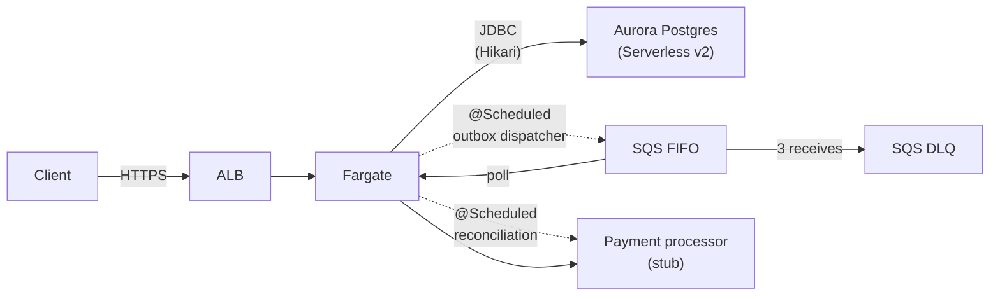

# Payment Intent Service

A showcase implementation of a payments-domain service, built to demonstrate the engineering practices that matter when reliability is a feature: clean architecture, transactional consistency, async resilience, and operational visibility.

The service models the lifecycle of payment intents — from creation through authorization, capture, and refund — with strong invariants, idempotency at three layers, and a transactional outbox for reliable event publishing. It runs on AWS, deployed via CDK (TypeScript), with a Spring Boot (Java 21) application backed by Aurora Serverless v2 PostgreSQL.

This is a deliberately small system. The interesting work is in the design, not the surface area.

## Why this exists

I built this as a showcase project during a freelance gap, focused on a problem domain where engineering rigor is non-negotiable: payments. The design choices throughout prioritize correctness under failure over feature breadth.

If the service is processing a payment when the host crashes, no payment is silently lost or duplicated. If a client retries a request because of a network timeout, the retry returns the original outcome rather than charging twice. If the downstream message bus is briefly unavailable, the system catches up automatically when it recovers. These properties don't come from a framework; they come from specific design decisions documented below.

## Architecture at a glance



Three CDK stacks: `PaymentBootstrap` (one-time GitHub OIDC + IAM roles), `NetworkStack` (VPC), `PaymentServiceStack` (database, compute, queues, observability). Compute is a single Fargate task running the Spring Boot service. An embedded `@Scheduled` outbox dispatcher publishes events to SQS FIFO; a polling consumer in the same JVM (`PaymentEventListener`) reads them back, deduplicates via `processed_events`, and calls the (stubbed) payment processor. A separate `@Scheduled` reconciliation job recovers intents stuck in `PROCESSING` after `Unknown` outcomes.

## Tech stack

- **Application**: Java 21, Spring Boot 3, Spring Web, Spring Data JDBC, Flyway, Resilience4j, Micrometer
- **Database**: Aurora Serverless v2 PostgreSQL with scale-to-zero
- **Messaging**: SQS FIFO, SQS DLQ, custom outbox pattern
- **Compute**: ECS Fargate behind ALB; consumer runs in the same JVM via a polling adapter (Lambda would be a drop-in alternative)
- **Infrastructure**: AWS CDK (TypeScript)
- **CI/CD**: GitHub Actions with OIDC federation
- **Observability**: CloudWatch dashboards, alarms, and Logs Insights; Micrometer with the OpenTelemetry tracing bridge ready (no exporter wired today)
- **Local development**: Postgres + LocalStack via `docker compose`; integration tests gate on TCP probes and skip cleanly when the deps aren't running

## Domain model

The aggregate root is `PaymentIntent`. It owns child entities `PaymentAttempt`, `Capture`, and `Refund`, plus value objects `Money`, `PaymentMethod`, `IdempotencyKey`, and identifiers.

The aggregate enforces all business invariants:

1. Total captured amount cannot exceed authorized amount
2. Total refunded amount per capture cannot exceed that capture's amount
3. All amounts share the intent's currency
4. State transitions follow a declared graph
5. Canceled or failed intents cannot be modified
6. Amounts are positive and meet the currency's minimum

The state machine has nine states. Notably, `CAPTURED` is not terminal — refunds can still be issued — and refunds are modeled as child entities rather than intent state transitions, which is the more common modeling mistake.

```
REQUIRES_PAYMENT_METHOD ─┬─▶ REQUIRES_CONFIRMATION ─┬─▶ PROCESSING ─┬─▶ AUTHORIZED ─┬─▶ CAPTURED
                         │                          │               │               │      │
                         │                          │               ├─▶ REQUIRES_   │      ├─▶ PARTIALLY_CAPTURED
                         │                          │               │   ACTION      │      │
                         │                          │               │               │      │
                         └──────────────────────────┴──▶ CANCELED   └─▶ FAILED      └──────┘
```

Commands on the aggregate emit domain events. Events are collected during command handling and persisted to the outbox in the same transaction as the state change.

State transitions are encoded as an explicit table, not scattered conditionals. Invalid transitions throw `InvalidStateTransitionException` from inside the aggregate — the domain protects its own invariants without help from services.

## The three layers of idempotency

Reliable payment processing requires guarding against duplication at every place duplication can occur. There are three:

**1. API layer — idempotency keys.** Every mutating endpoint requires an `Idempotency-Key` header. Keys are scoped per-merchant and stored in an `idempotency_records` table, with the request hash stored to detect "same key, different body" misuse. The implementation uses `INSERT ... ON CONFLICT DO NOTHING` for race-free key reservation. Five distinct outcomes are handled explicitly: new key, replay of completed request, in-progress concurrent retry, body mismatch, and prior failure. Records expire after 24 hours.

**2. Outbox relay — deduplication IDs.** Each outbox row's UUID becomes the SQS `MessageDeduplicationId`. If the relay crashes between SQS acceptance and the database update marking the row published, the row is re-published — and SQS deduplicates within its 5-minute window.

**3. Consumer — processed event table.** The SQS consumer maintains `processed_events(event_id PRIMARY KEY)`. Before acting on a message, it inserts into this table; a duplicate primary key means the event was already processed and the consumer no-ops.

Each layer plugs a different gap. None of them alone is sufficient; together they make at-least-once delivery effectively exactly-once.

## The transactional outbox

Payment state changes are persisted to the database, and downstream consumers are notified via SQS. Doing these as separate operations creates a dual-write problem with four outcomes — two correct, two catastrophic (lost or phantom events).

The outbox pattern eliminates the catastrophic cases by inserting into an `outbox` table in the same transaction as the aggregate change. A separate dispatcher reads unpublished rows and publishes them to SQS, marking them published on success.

Implementation details worth noting:

- The dispatcher uses `SELECT ... FOR UPDATE SKIP LOCKED` to allow horizontal scaling without coordination
- Failed publishes get exponential backoff with jitter, capped at 5 minutes between attempts
- After 10 failed attempts a row is poisoned and a CloudWatch alarm fires for human review
- Published rows older than 7 days are deleted by a scheduled cleanup job
- The current implementation runs the dispatcher in-process via `@Scheduled` for simplicity; Debezium with Postgres logical replication would be the right move at higher scale

The outbox + SQS FIFO combination uses `aggregate_id` as `MessageGroupId`, giving per-intent ordering with cross-intent parallelism.

## Processor integration

The integration with the external payment processor is structured around three principles:

**Three outcome types, not two.** The `AuthorizationResult` sealed interface distinguishes `Authorized`, `Declined`, and `Unknown`. The `Unknown` case — typically caused by timeout — is the source of most payment system bugs because the obvious move (retry) can double-charge. The correct response is reconciliation via the processor's lookup endpoint.

**Layered resilience.** Every external call has a timeout, an idempotency key, a circuit breaker (Resilience4j), and a bulkhead. Retries are policy-based: never retry on `Unknown`, retry with backoff on definite transient errors, never retry on declines.

**Bounded reconciliation.** When `Unknown` occurs, the consumer leaves the intent in `PROCESSING`; a `@Scheduled` reconciliation job picks it up after a stuck-threshold and calls `processor.lookup()` to discover what really happened. The current scaffold polls every 30s by default and applies any definitive outcome via the same use case path; a 10-attempts/24h give-up cap is the next polish item before this would be production-ready.

A single UUID flows through the entire async pipeline: outbox row ID → SQS deduplication ID → processor idempotency key → consumer's processed-events table. One identity end-to-end.

The processor is currently stubbed. The stub is calibrated to exercise every failure mode the production code is designed to handle: 80% authorize, 10% decline (varied reasons), 5% timeout, 5% server error, 2% hang. Failure rates are configurable via Spring properties for chaos testing. Swapping in a real processor (e.g., Stripe) is a one-class change to the adapter, plus DTO definitions and webhook handling.

## Card data handling

The service never sees raw card data. The design assumes upstream tokenization: the client UI exchanges card data with the processor (or a tokenization service), receives a token, and passes the token to this service. `PaymentMethod` is a token reference. This keeps the service out of PCI DSS scope.

Request and response logging is whitelist-based — only fields explicitly marked safe are logged.

## Architecture and code structure

Hexagonal layering, enforced by ArchUnit tests:

```
com.example.payments
├── domain/
│   ├── model/           Aggregate, entities, value objects, events, state machine
│   ├── port/            Repository interfaces, EventPublisher, Clock, PaymentProcessor
│   └── exception/       Domain exceptions
├── application/
│   ├── usecase/         Use cases (one per command)
│   └── idempotency/     IdempotencyService
├── adapter/
│   ├── in/rest/         Controllers, DTOs, exception handlers
│   ├── in/sqs/          SQS consumer
│   ├── out/persistence/ JDBC repositories, outbox dispatcher, Flyway migrations
│   ├── out/messaging/   SQS publisher
│   └── out/processor/   Processor adapters (real and stub)
└── config/              Spring wiring
```

ArchUnit tests assert that `domain` does not depend on Spring, JDBC, or any adapter. The domain is plain Java and could in principle be moved to a separate module.

## Infrastructure

Three CDK stacks. Different lifecycles, different deploy cadences.

**`PaymentBootstrap`** — one-time per AWS account. Provisions the GitHub Actions OIDC provider plus two roles trust-scoped via the `sub` claim: a deploy role trusted only from `refs/heads/main`, and a read-only role trusted from any branch in the repo. Output ARNs go into the repo's `DEPLOY_ROLE_ARN` and `READONLY_ROLE_ARN` secrets.

**`NetworkStack`** — VPC only. Two AZs, public and isolated subnets, no NAT Gateway by design (cost): the Fargate service runs with a public IP for outbound, and Aurora is reachable only from the app's security group via private routing. In production I would either add a NAT Gateway or use VPC endpoints for AWS services. Security groups deliberately live in the service stack rather than here so SG-to-SG rules stay intra-stack and don't form a dependency cycle.

**`PaymentServiceStack`** — security groups, Aurora Serverless v2 (min 0 ACU, max 1 ACU, scale-to-zero enabled), ECS Fargate service behind ALB with the app's polling SQS consumer in the same JVM, SQS FIFO + DLQ, CloudWatch dashboards and alarms, IAM roles. Database credentials managed via Secrets Manager: the JDBC URL is composed at runtime from `host`/`port`/`dbname` injected as separate ECS secrets.

CDK unit tests assert structural invariants:

- Aurora cluster has `storageEncrypted: true`
- Every queue has a redrive policy
- Every SNS topic enforces TLS
- ECS service has the deployment circuit breaker enabled (`Rollback: true`)
- The app log group name `/aws/ecs/payment-service` matches the dashboard's Logs Insights query
- Bootstrap's deploy role trust is scoped to `refs/heads/main`; readonly role to the repo

These tests treat security and reliability invariants as code-reviewable assertions. A future change that violates them fails CI.

## Observability

A single CloudWatch dashboard organized around four operator questions: is the system healthy now, did the last deploy break anything, why are payments failing, are we trending toward a problem.

The dashboard is laid out top-to-bottom in priority order: at-a-glance health (success rate, P99 latency, outbox lag, DLQ depth) at the top; API metrics; payment business metrics (state transition counts, authorization success rate, capture/refund volume); outbox and async pipeline; infrastructure; recent alarms and top error logs.

Business metrics — like authorization success rate — are emitted from domain event handlers rather than controllers. This means the metric reflects actual state changes, not API call attempts; the two diverge in the presence of validation failures and idempotency replays.

Alarms are split into two SNS topics: paging alarms (system-down conditions, DLQ non-empty, success rate collapse) and notification alarms (capacity warnings, slow responses). One composite alarm captures "the system is meaningfully broken" — multiple conditions simultaneously — and is the only alarm wired to a paging destination.

CloudWatch metric cardinality is deliberately bounded; tag dimensions are limited to currency and merchant for a small number of test merchants. Production usage with high merchant counts would aggregate or sample.

## CI/CD

Three GitHub Actions workflows: `pr-checks.yml`, `deploy.yml`, and `nightly.yml`.

PR checks run in parallel: app build with unit and integration tests, static analysis (Spotless), CDK type-check, synth, and unit tests. PR feedback target is under 8 minutes. A `cdk diff` PR comment using the read-only OIDC role is scaffolded but disabled — uncomment in `pr-checks.yml` once the role secret is populated.

Deploy on merge to `main` runs sequentially: build app → publish image to ECR → deploy infra (`cdk deploy`) → run Flyway migrations → update ECS service → smoke test against deployed service → automatic rollback on smoke-test failure.

Database migrations follow the **expand/contract** pattern: schema changes are designed to be backward-compatible with the currently-deployed application version, so deploys can roll forward and back without coordination. A column addition deploys as a migration first, then app; a column removal deploys as app first, then migration.

ECS deployments use the deployment circuit breaker (`DeploymentCircuitBreaker.rollback: true`) — a bad image fails health checks and is automatically rolled back rather than leaving a service crash-looping.

AWS authentication from GitHub Actions uses **OIDC federation** with short-lived credentials, scoped per branch. Two roles: a deploy-capable role trusted only from `main`, and a read-only role trusted from PR branches for `cdk synth` and `diff`. No long-lived AWS keys are stored in GitHub.

## What's deliberately not implemented

Showcase scope means making explicit choices about what to leave out. I considered each of these and chose not to implement them for specific reasons:

- **Staging environment** — cost. A second Aurora cluster isn't justified for a demo. In a real org, I'd add staging with production-like traffic patterns and use it as the smoke-test target before promoting to production.
- **Canary deployments via CodeDeploy** — complexity. ECS rolling deploy with the deployment circuit breaker is sufficient for the showcase. CodeDeploy with traffic-shifting and CloudWatch alarm gates is the right move at scale; the CDK has constructs for this.
- **Multi-region** — cost and scope. Real payment systems often run active-active multi-region; the design here would extend with cross-region Aurora Global Database, but that's a project of its own.
- **Full event sourcing** — discipline. Current state lives in aggregate tables; events are stored in an audit log. Full event sourcing is a rabbit hole that doesn't fit a showcase timeline.
- **Real processor integration** — onboarding. The stub exercises every failure mode of interest. Swapping in Stripe is a one-class change plus webhook handling.
- **3D Secure / step-up authentication** — out of scope; the `REQUIRES_ACTION` state exists in the model but is not exercised end-to-end.
- **Performance and load testing** — interesting but space-consuming; k6 or Gatling would be the choice.
- **Feature flags / progressive delivery** — a real team would add LaunchDarkly or similar; for a single-service demo, plain config suffices.
- **NAT Gateway / VPC endpoints** — cost. The Fargate task uses a public IP for outbound. Production would replace this with either, depending on traffic volume.

Each of these is a real consideration. I'd rather call them out than hide them.

## Cost

Designed to run within or near the AWS Free Tier. Realistic monthly cost when idle (Aurora scaled to zero, Fargate task count 0): under €2/month. With the service running and the ALB always-on: approximately €17–18/month.

The cost-conscious deploy mode is `cdk deploy -c running=true` to scale up before demos and `cdk deploy -c running=false` to scale down after. A README note rather than glamour, but cost discipline is part of operational thinking.

## Running locally

```bash
# Prerequisites: Java 21, Docker, Node 20

# Bring up Postgres + LocalStack
docker compose up -d

# Run the service against compose Postgres on localhost:5432
./gradlew bootRun

# Full test suite. Integration tests are gated on TCP probes of localhost:5432
# (Postgres) and localhost:4566 (LocalStack); they skip cleanly when those
# aren't running rather than failing.
./gradlew test

# Synth the CDK stacks (no AWS account required)
cd infrastructure
npm install
npx cdk synth --all
```

The processor adapter is wired by `@Profile("!real-processor")`, so the stub is on by default in every environment that doesn't explicitly opt out.

## Deploying

```bash
cd infrastructure
npm install
npx cdk bootstrap                           # CDK bootstrap, once per account/region
npx cdk deploy PaymentBootstrap \
  -c githubOrg=<your-org>                   # one-time: GitHub OIDC + IAM roles
# Then copy DeployRoleArn and ReadonlyRoleArn from the outputs into the
# repo's DEPLOY_ROLE_ARN / READONLY_ROLE_ARN secrets.
npx cdk deploy PaymentNetwork PaymentService   # day-to-day
```

After deploy, the ALB DNS name is exported as a CloudFormation output. Smoke test:

```bash
curl https://<alb-dns>/actuator/health
```

To tear down completely:

```bash
npx cdk destroy --all
```

Aurora is configured with `removalPolicy: DESTROY` for clean teardown. In production, deletion protection would be enabled.

## Notes for reviewers

A few specific things worth examining:

- `app/src/main/java/com/example/payments/domain/model/PaymentIntent.java` — the aggregate, with state transition table and invariant checks
- `app/src/main/java/com/example/payments/application/idempotency/IdempotencyService.java` — the five-case idempotency handling
- `app/src/main/java/com/example/payments/adapter/out/persistence/OutboxDispatcher.java` — the polling dispatcher with `FOR UPDATE SKIP LOCKED`
- `app/src/main/java/com/example/payments/adapter/out/processor/StubPaymentProcessor.java` — failure mode simulation
- `infrastructure/lib/observability/dashboard.ts` — CloudWatch dashboard structure
- `.github/workflows/deploy.yml` — the deploy pipeline with rollback
- `app/src/test/java/com/example/payments/architecture/` — ArchUnit tests

## Project status

Phases 1–9 of `docs/BUILD_ORDER.md` are complete. The domain, application use cases, JDBC persistence, REST adapter with idempotency filter, async pipeline (outbox dispatcher + SQS consumer + reconciliation), CDK stacks, CloudWatch observability, CI/CD workflows, and polish are in place.

A handful of operational TODOs remain in `.github/workflows/deploy.yml` (separate Flyway migration task, smoke test against a live ALB, ECR image cleanup) — these need an actual AWS account to validate, so they're labeled rather than guessed at.

## License

MIT.
